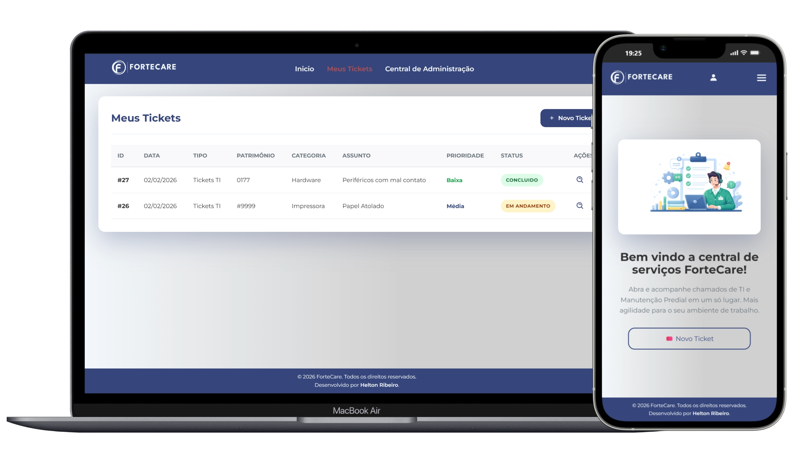

# 🎫 Service Desk Interno

Sistema web desenvolvido para gestão de tickets de TI e de manutenções internas

## 📸 Preview do Sistema

## 🧠 Sobre o Projeto

Sistema web para gestão de chamados internos de TI, desenvolvido com o objetivo de centralizar solicitações, manter um histórico completo de manutenções e otimizar o fluxo de atendimento técnico.

A plataforma reduz falhas de comunicação, melhora o controle das demandas e aumenta a produtividade da equipe.

## ⚙️ Funcionalidades

- ✅ Abertura e gerenciamento de chamados  
- ✅ Controle de status com fluxo de aprovação do solicitante  
- ✅ Organização por prioridade  
- ✅ Gestão de usuários e hierarquias de acesso  
- ✅ Gestão de patrimônio de TI  
- ✅ Relatórios personalizados integrados ao Power BI  
- ✅ Interface intuitiva e responsiva  

## 🛠️ Tecnologias Utilizadas

  
  
  
  
  
  
  
  
  

## 🚀 Deploy

Este projeto foi desenvolvido sob demanda para uso interno, por isso o repositório completo não está disponível publicamente.  

No entanto, uma versão demonstrativa pode ser acessada em:  
🔗 [https://demo-fortecare.com](https://demo-service-desk.vercel.app/index.html)

## 👨‍💻 Desenvolvido por

**Helton Ribeiro**  
Fundador da **HR|DEV**  
Desenvolvedor Web Freelancer  

🌐 Portfólio: https://hrdev.com.br  
💼 LinkedIn: https://www.linkedin.com/in/devheltonribeiro/  
📧 Contato: oiheltong@gmail.com 
